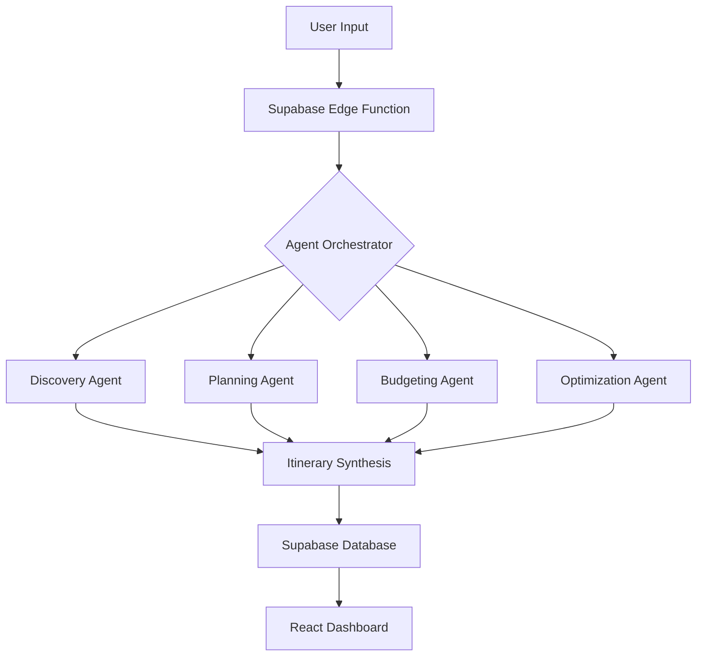

# 🌍 Trip Weaver AI

> **Your Dream Trip, Architected by Intelligence in Under 2 Minutes.**


Trip Weaver AI is a premium, AI-driven travel planning platform that leverages a sophisticated multi-agent pipeline to craft personalized, high-fidelity Indian travel itineraries. By orchestrating four specialized AI agents, the platform handles everything from destination discovery to granular budgeting and logistics.

---

## 🚀 Key Features

### 🤖 Multi-Agent AI Pipeline
Our proprietary orchestrator manages four specialized agents that work in parallel to build your perfect trip:
- **Discovery Agent**: Analyzes your traveler profile to find hidden gems and "must-visit" landmarks.
- **Planning Agent**: Curates a day-to-day itinerary optimized for travel time and experience density.
- **Budgeting Agent**: Provides two-tier budget options (Frugal & Comfort) with line-item estimates.
- **Optimization Agent**: Cross-references logistics, safety, and local timing to ensure a seamless flow.

### 🌐 Interactive 3D Visualization
- **Dynamic Globe**: Visualize your journey on a high-performance 3D interactive globe.
- **Real-time Markers**: See your origin and destination pulses as the AI generates your plan.
- **Glassmorphic UI**: A premium, responsive interface that feels alive with micro-animations.

### 📊 Intelligent Dashboard
- **KPI Monitoring**: Track your travel stats, including Total Trips, Plans Generated, and Active Sessions.
- **Trip History**: Manage and revisit all your AI-crafted plans in one centralized hub.
- **Profile Analysis**: Fine-tune your "Traveler Intelligence" parameters (Traveller Type, Budget Tier) to sharpen future AI accuracy.

### 💬 AI Travel Assistant
- **Contextual Chat**: A persistent AI companion ready to answer questions about safety, weather, or local tips for your specific trip.

---

## 🛠️ Technology Stack

| Layer | Technology |
| :--- | :--- |
| **Frontend** | [React 18](https://reactjs.org/) + [Vite](https://vitejs.dev/) |
| **Language** | [TypeScript](https://www.typescriptlang.org/) |
| **Styling** | [Tailwind CSS](https://tailwindcss.com/) + [Shadcn UI](https://ui.shadcn.com/) |
| **Animations** | [Framer Motion](https://www.framer.com/motion/) |
| **3D Graphics** | [Cobe](https://github.com/shuding/cobe) |
| **Backend/DB** | [Supabase](https://supabase.com/) |
| **AI Engine** | [Gemini Pro](https://deepmind.google/technologies/gemini/) (via Supabase Edge Functions) |
| **State/Data** | [React Query](https://tanstack.com/query/v5) |

---

## ⚙️ Architecture



---

## 🚀 Getting Started

### Prerequisites
- [Node.js](https://nodejs.org/) (v18+) or [Bun](https://bun.sh/)
- [Supabase CLI](https://supabase.com/docs/guides/cli)
- A Supabase Project with Edge Functions enabled

### Installation

1. **Clone the repository**
   ```bash
   git clone https://github.com/amirtishiva/trip-weaver-ai.git
   cd trip-weaver-ai
   ```

2. **Install dependencies**
   ```bash
   npm install
   # or
   bun install
   ```

3. **Environment Setup**
   Create a `.env` file in the root:
   ```env
   VITE_SUPABASE_URL=your_supabase_url
   VITE_SUPABASE_ANON_KEY=your_supabase_anon_key
   ```

4. **Run Development Server**
   ```bash
   npm run dev
   ```

---

## 📁 Project Structure

```text
├── src/
│   ├── components/       # Shadcn UI & Custom Features
│   ├── contexts/         # Auth & Global States
│   ├── hooks/            # Custom React Hooks
│   ├── integrations/     # Supabase Client & Types
│   ├── pages/            # View Layers (Dashboard, Plan, etc.)
│   └── lib/              # Utilities & Theme Logic
├── supabase/
│   └── functions/        # AI Agent Edge Functions (Deno)
├── public/               # Static Assets & Global Icons
└── index.html            # Entry Point
```

---

## 🛡️ Security
- **Row Level Security (RLS)**: Every trip and profile is protected by Supabase RLS policies.
- **Secure Authentication**: Integrated Supabase Auth with support for various providers.
- **Edge Secrecy**: AI API keys are stored securely in Supabase Secrets and never exposed to the frontend.

---

## 📄 License
This project is licensed under the MIT License - see the LICENSE file for details.

---

**Crafted with ❤️ by the Trip Weaver Team**
